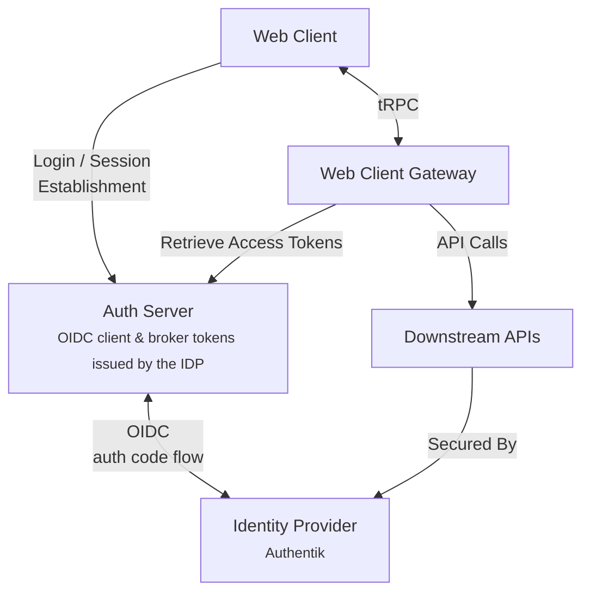

# BeautifulYeti.Authentication

```mermaid

graph 

%% Client
WC[Web Client]

%% Core Services
TRPC[Web Client Gateway]
AUTH[Auth Server\n<small>OIDC client & broker tokens issued by the IDP</small>]

%% External Systems
IDP[Identity Provider\n<small>Authentik</small>]
API[Downstream APIs]

%% Relationships

WC <-- tRPC --> TRPC
WC -- Login / Session\nEstablishment --> AUTH

AUTH <-- OIDC\nauth code flow --> IDP

TRPC -- Retrieve Access Tokens --> AUTH

TRPC -- API Calls --> API

API -- Secured By --> IDP

```